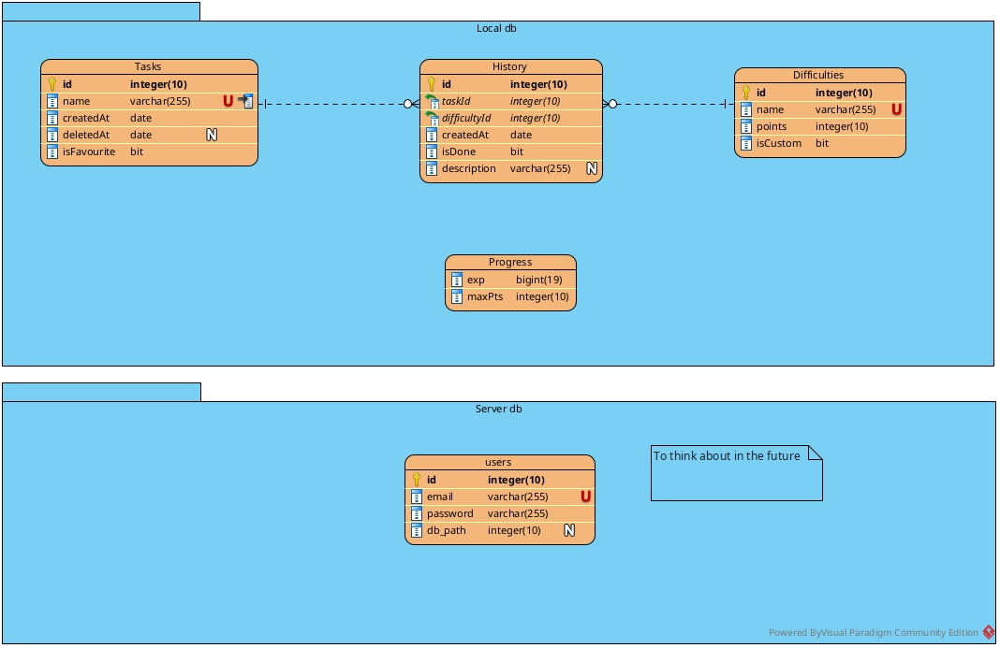

# Analysis and Design
This document describes the requirements and their implication on the system.

Since all the functional requirements depend on the database choice and design, it is more practical to base these requirements
on the design of the database.

## Design of the database:
Since we want privacy, the application should have a local database. An SQL database provides some rules to the business logic
(database relationships, types of the columns, triggers, ...).

The database schema is the following: 

### Local Db
- Tasks: This is for creating and reusing tasks. the name is indexed for auto-complete.
- Difficulties: This is for the available difficulties. Can be made custom.
- History: Couple a task with a difficulty with providing the ability to add a description to it.

### Server db:
- users: To store the user authentication info and the path to their encrypted db

## Functionalities:
### F1: CRUD of the tasks:
- The user should be able to create tasks
- The title used should be unique.
- The title is an index and should be used for autocomplete
- Searching for the tasks should be case-insensitive.
- Tasks is a paranoid table and the deletion of a task only sets the deleted at. This is for helping with the stats.
- A task can be made favourite. and can be added without typing: To improve the UX
- Editing a tasks should not be made possible if this tasks was already used: The edit should create a new task.

### F2: Creating a history
- The user creates a todo each day. The user chooses a title for it, chooses a difficulty and optionally add
a description for this todo. If the title of the tasks is non-existing, a new tasks should be made with this title. If it
does exist then the todo should use the id of the newly created task.
- Creating a todo for the day is only possible if the user has enough credit for it.

### F3: Leveling up:
- After the user marks a task as done, the points of the difficulty of this task should be added to the user's experience meter
- After the user reaches a milestone, they will level up and more credit and features would be allowed for them.
- The level of the user can be calculated from the history of the todos. Using a trigger in the db each time a task is added
might be worth looking at, as it can be much faster than querying all the history.
### F4: Difficulties:
- After reaching a certain level, a new difficulty with a higher pts will be created. After another level maybe the user will
be allowed to create their own difficulties.

### F5: Syncing:
It would be such a bummer if the user loses their progress for some reason: Data loss. Or if they want to use another device for their tasks.
This feature is to allow the users to have their data saved elsewhere. But the tasks of each user are personal and should be treated with
respect, specially in an era where companies sell everyone's data. For this, the following solution is proposed:
1. The user creates their account in our server. password (hashed) and email.
2. The user invokes the service for the syncing.
3. The db is exported and zipped.
4. The user chooses a passphrase that should be used to encrypt the database.
5. The encrypted database is then sent to our server and saved with the algorithm used for the encryption (if necessary)

Restoring the user's data is done like this:
1. The user authenticates.
2. The encrypted db is then downloaded to the user's device.
3. The user provides the passphrase used in the encryption.
4. if right the db will de decrypted, unzipped and then restored. 

This process is explained using the following activity diagram: (TODO)

